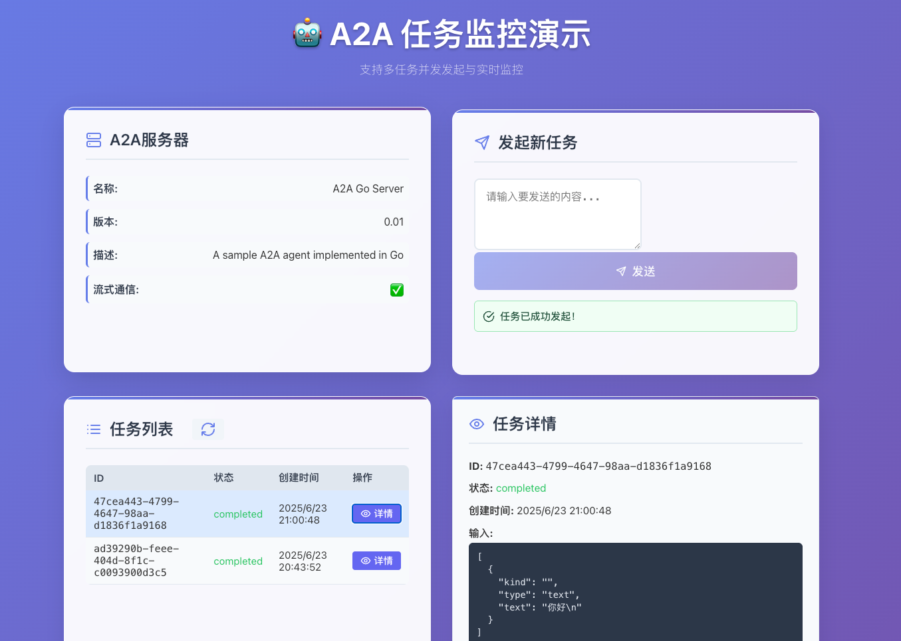

# Simple Client Example (with Web Frontend)

This example demonstrates how to build a simple Agent-to-Agent (A2A) client using the `a2ago` library, and how to interact with a visual web frontend. It shows how to connect to an A2A server, send messages, query the real-time status of tasks, and experience the protocol visually.

## Overview

- **A2A Server**: Provides the backend agent service (see `server-hello-world` example)
- **Simple Client**: CLI client for sending messages and querying tasks
- **Web Frontend**: Modern React-based UI for visualizing and interacting with the A2A server

## Quick Start

### 1. Start the A2A Server

First, start the backend server:

```bash
cd examples/server-hello-world
# Install Go dependencies if needed
go mod download
# Run the server
go run main.go
```

The server will listen on `http://localhost:8089`.

### 2. Start the Web Frontend

Open a new terminal and start the web UI:

```bash
cd web
npm install
npm run dev
```

The frontend will be available at `http://localhost:5173` (or as shown in the terminal).

### 3. (Optional) Run the Simple CLI Client

You can also run the CLI client to send test messages:

```bash
cd examples/simple-client
go mod download
go run main.go
```

## What You Will See

- The web UI provides a dashboard to:
  - View A2A server info and capabilities
  - Send messages and create tasks
  - Monitor all tasks and their real-time status
  - View task details and results
- The CLI client demonstrates basic programmatic usage

## Screenshot

> 


## Code Structure

- `main.go`: CLI client initialization and main logic
- `client.go`: A2A client implementation (if present)
- `model.go`: Data models and types (if present)
- `../web/`: React web frontend source code

## License

This example is part of the A2AGO project and is licensed under the MIT License. 