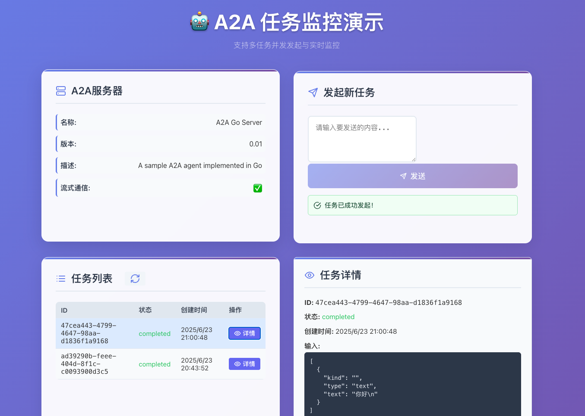

# 简单客户端示例（含 Web 前端）

本示例展示了如何使用 `a2ago` 库构建一个简单的 Agent-to-Agent (A2A) 客户端，并结合可视化 Web 前端进行交互体验。你可以连接到 A2A 服务器，发送消息，查询任务实时状态，并通过现代化界面直观体验 A2A 协议。

## 概览

- **A2A 服务器**：后端 Agent 服务（见 `server-hello-world` 示例）
- **简单客户端**：命令行客户端，发送消息和查询任务
- **Web 前端**：基于 React 的现代 UI，可视化交互和监控

## 快速开始

### 1. 启动 A2A 服务器

首先启动后端服务：

```bash
cd examples/server-hello-world
# 如有需要先安装依赖
go mod download
# 启动服务
go run main.go
```

服务器监听在 `http://localhost:8089`。

### 2. 启动 Web 前端

打开新终端，启动前端界面：

```bash
cd web
npm install
npm run dev
```

前端页面默认在 `http://localhost:5173`（或终端提示的端口）。

### 3. （可选）运行命令行客户端

你也可以运行 CLI 客户端进行测试：

```bash
cd examples/simple-client
go mod download
go run main.go
```

## 你将看到什么？

- Web 前端提供仪表盘，支持：
  - 查看 A2A 服务器信息和能力
  - 发送消息、创建任务
  - 实时监控所有任务状态
  - 查看任务详情和结果
- CLI 客户端演示基础编程用法

## 截图

> 


## 代码结构

- `main.go`：CLI 客户端初始化和主逻辑
- `client.go`：A2A 客户端实现（如有）
- `model.go`：数据模型和类型（如有）
- `../web/`：React Web 前端源码

## 许可证

本示例属于 A2AGO 项目，采用 Apache 许可证。 